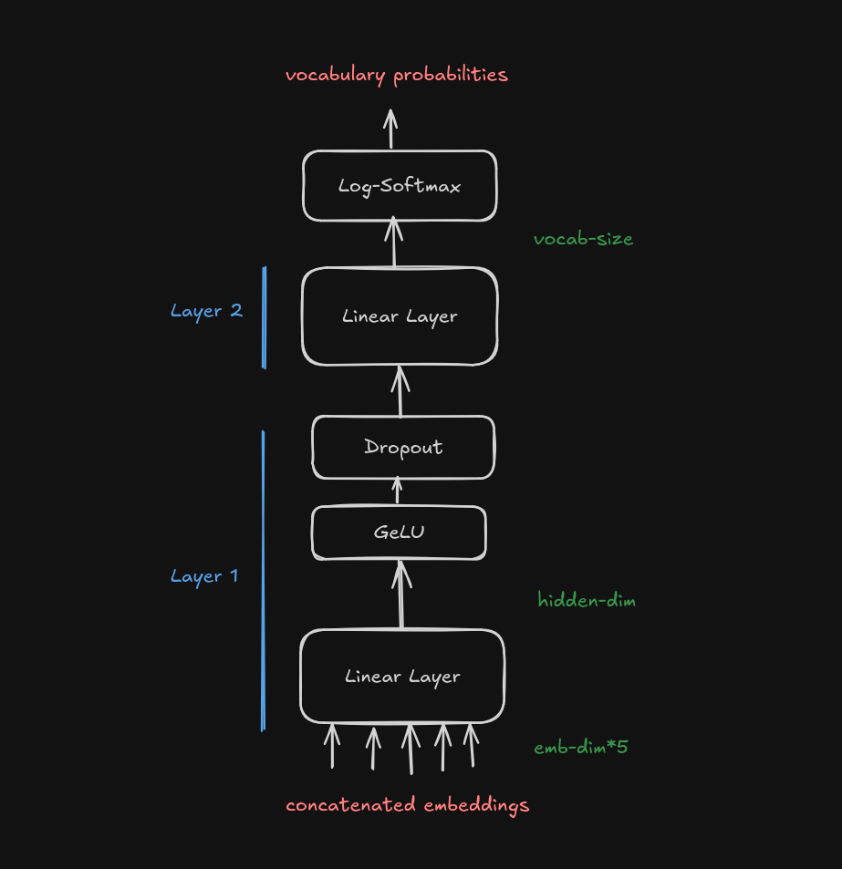
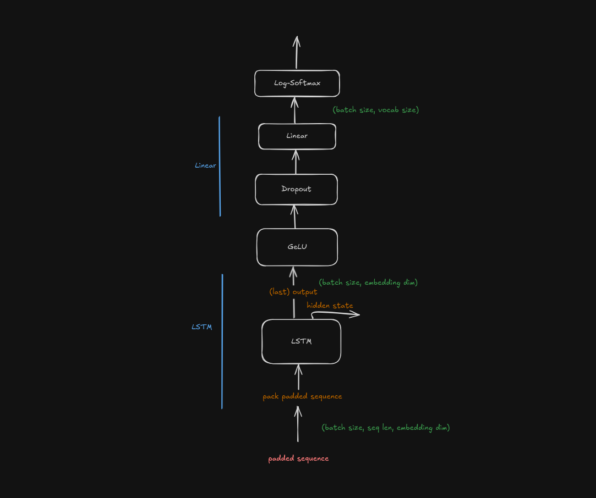

# language-models
*Assignment 1* of *Advanced Natural Language Processing* (IIIT-Hyderabad, Monsoon '24)

An implementation of some basic next word prediction language models - currently consisting of a feed forward neural network model, a sequential model (lstm), and a transformer decoder. 

## installation
The env files are available in [the data directory](./data/). 
If you want to resolve the dependencies yourself, refer to [the env file created from history](./data/envs-hist.yml), else, attempt the installation as below. 

```sh
conda env create -f data/envs-all.yml
```

In addition, download a 300 dim [glove model](https://nlp.stanford.edu/projects/glove/) and move it to [the data/glove directory](./data/glove/glove.6B.300d.txt). In [processing.py](./src/common/processing.py), the path is assumed to be "./data/glove/glove.6B.300d.txt". 

## running the models 
The main module allows for the following options:
- `model` specifies the model itself
- `batch_size`
- `epochs`
- `sent_len` specifies the length of every sample, predicting the last word based on the beginning of the sample. If it is not specified, we predict the last word of an arbitrary length sentence based on the beginning. Note that for the Neural Network Language Model, we have to specify some fixed length. 

**Currently, a run consists of a train and a test run, but the two calls are completely de-coupled and may be separated to two calls later.**

```sh
python -m src.main <model>
```
Optionally add `--batch_size`, `--epochs`, `--sent_len`. 

Some samples include:
```sh
python -m src.main ffnnm sent_len=5 epochs=10 batch_size=8192
python -m src.main lstm epochs=10 batch_size=4096
python -m src.main tra-dec epochs=10 batch_size=64
```

## model details 
For additional details and hyperparameter analysis and tuning, check out [the report](./docs/report.pdf). 

In the assignment, `torchtext` was used for the word embeddings. The [report](./docs/report.pdf) was written with these embeddings. 

Since it is now deprecated, the models now use `glove` embeddings. 

### Feed Forward Neural Network Model ("ffnnm")


### Sequential Model ("lstm")


### Transformer Decoder Model ("tra-dec")

