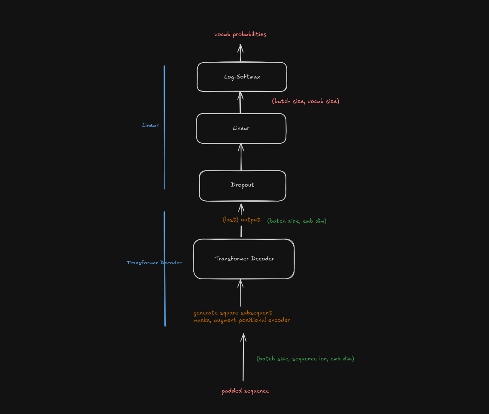

# language-models
*Assignment 1* of *Advanced Natural Language Processing* (IIIT-Hyderabad, Monsoon '24)

## installation
The env files are available in [the data directory](./data/). 
If you want to resolve the depdencies yourself, refer to [the env file created from history](./data/envs-hist.yml), else, attempt the installation as below. 

```sh
conda env create -f data/envs-all.yml
```

## running the models 
The main module allows for the following options:
- `model` specifies the model itself
- `batch_size`
- `epochs`
- `sent_len` specifies the length of every sample, predicting the last word based on the beginning of the sample. If it is not specified, we predict the last word of an arbitrary length sentence based on the beginning. Note that for the Neural Network Language Model, we have to specify some fixed length. 

```sh
python -m src.main <model>
```
Optionally add `--batch_size`, `--epochs`, `--sent_len`. 

Some additional data can be found [here](https://drive.google.com/drive/folders/1ksRhdfaXNlQeUQaZz2e52wWdB12NVzXU?usp=sharing). 

## model details 
We use `torchtext` for the embeddings. The models themselves are defined as below. 

For additional details and hyperparameter analysis and tuning, check out [the report](./docs/report.pdf). 

### Neural Network Language Model ("nnlm")


### Recurrent Neural Network ("rnn")


### Transformer Decoder ("tra-dec")


## todo
- [ ] move to GLoVe, think about the UNK as a result
